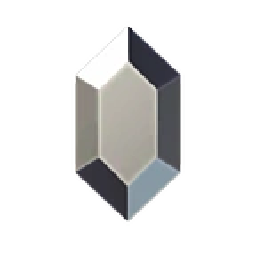
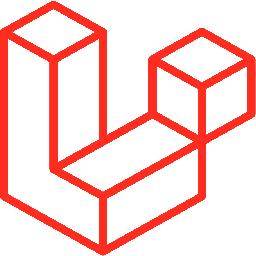

  <h1 align="center"> 
    
    Hi! Welcome To My Profile
    
  </h1>

  <h4 style="padding: 10px;">
    
&nbsp;18/06/1999

    
🌎 Paranaguá/PR (Brazil)

    
📚 Technology in Systems Analysis and Development 5/6 - IFPR (Campus Paranaguá)

    
🔧 Computer And Printer Maintenance Technician

    
⌨️ Systems Developer

  </h4>

  <h3 align="center" style="padding: 30px;">
    
Databases

    
    
    
    
  </h3>

  <h3 align="center" style="padding: 30px;">
    
Development Languages

    
    
    
    
    
    
  </h3>

  <h3 align="center" style="padding: 30px;">
    
Frameworks

    
    
    
    
    
  </h3>

  <h3 align="center" style="padding: 30px;">
    
Markup Languages

    
    
  </h3>

  <h3 align="center" style="padding: 30px;">
    
Tools

    
    
    
    
    
    
  </h3>

  <h3 align="center" style="padding: 30px;">
    

  </h3>

  

    
    
    
    
  

  

